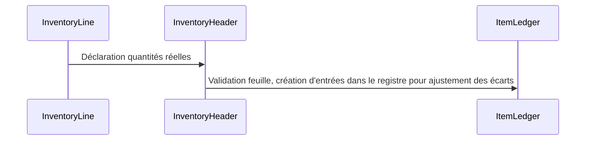
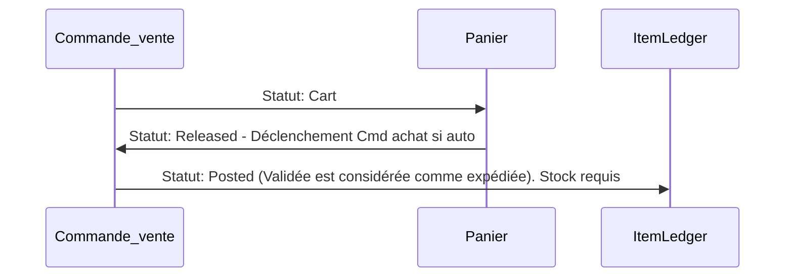
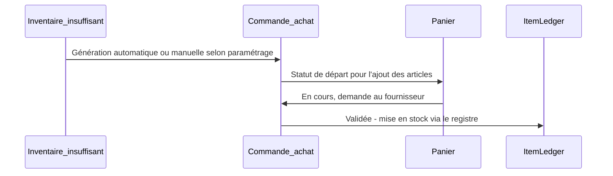

# api

## Inventaire

Les stocks ne sont pas gérés comme un champ qu'on vient incrémenter ou décrémenter. Les stocks sont le calcul de l'ensemble des écritures dans le registre article.

L'ajustement du stock se fait par les feuilles d'inventaires. L'opérateur renseigne ainsi le stock réel. Une fois validée, les écritures nécessaires dans le registre sont crées.

## Vente

## Achat

