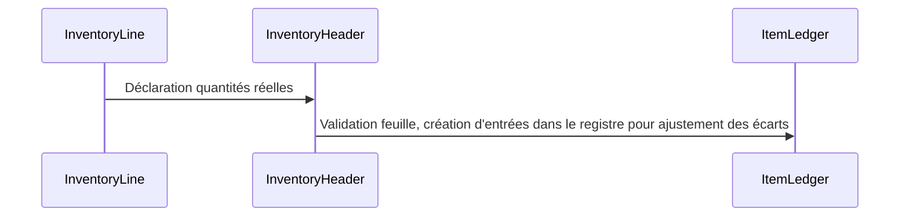
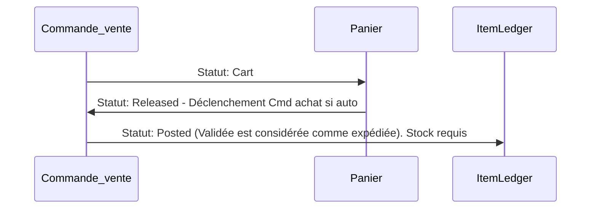
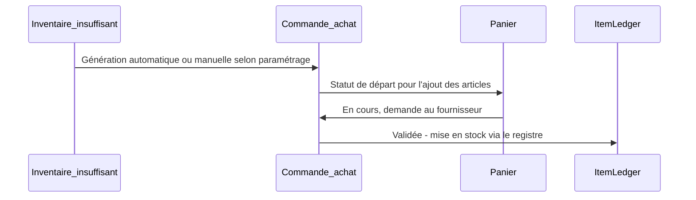

# api

## Initialisation du projet

### Base de données

Ce projet est conçu pour fonctionner avec une base de données SQL Server.
Montez votre propre base en local pour le développement.

### Variables d'environnement

Des variables d'environnement sont à renseigner dans le projet API.
Dupliquez le `.env.example`, renommez-le en `.env` et renseignez les variables.

### Lancement

À la racine de la solution, executer la commande suivante:

```bash
dotnet run --project API
```

## Inventaire

Les stocks ne sont pas gérés comme un champ qu'on vient incrémenter ou décrémenter. Les stocks sont le calcul de l'ensemble des écritures dans le registre article.

L'ajustement du stock se fait par les feuilles d'inventaires. L'opérateur renseigne ainsi le stock réel. Une fois validée, les écritures nécessaires dans le registre sont crées.



## Vente



## Achat


